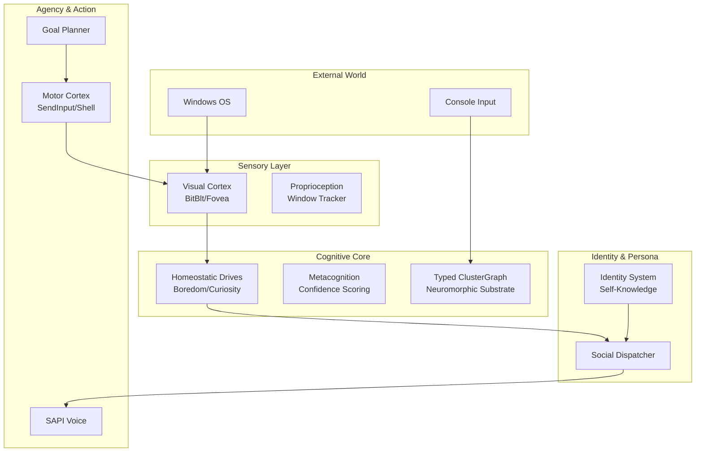

# FP-SAN architecture: Engram Core cognitive engine (**v17.0**)

## A proactive, autonomous neuromorphic daemon for Windows

**Engine version:** 17.0 (May 2026)  
**Public release track:** **v1.0.0** — see [README](README.md), [SECURITY.md](SECURITY.md), and [docs/BENCHMARK_RESULTS_v1.0.0.md](docs/BENCHMARK_RESULTS_v1.0.0.md).  
**Core thesis:** Proactive agency, foveated perception, and structured recall do not require cloud LLMs or massive datasets. They emerge from **homeostatic drives**, **spiking physics**, and **efference-copy-style verification**, bounded by **ShadowBrain veto** and operator controls ([SECURITY.md](SECURITY.md)).

Terminology: this document uses **Engram Core** for the user-facing daemon (`build\engram.exe`). Some internal identifiers may still carry legacy names (for example `jarvis_say` in source).

---

## 1. The living loop: homeostatic drives
Engram Core is not only a reactive state machine. Behavior is modulated by primary internal drives in `fpsan_drives.h`:

- **Boredom (passive tension):** Accumulates when idle. Above threshold it can trigger **spontaneous musing**—Engram Core picks a knowledge cluster and generates related output.
- **Curiosity (information gap):** Accumulates when words lack stable graph anchors; can trigger a **curiosity query** to the user.
- **Engagement (attentiveness):** Driven by external stimulation (input, visual change). Higher engagement raises cognitive update intensity.

---

## 2. Sensory & Perception
### A. Foveated visual cortex (`fpsan_screen_sensor.h`)
Instead of processing full frames, Engram Core uses **foveated sampling**:
1. **Window tracking:** `GetForegroundWindow` and `GetWindowText` for coarse OS awareness.
2. **Foveal capture:** Samples the active window via GDI `BitBlt` into a downscaled grid.
3. **Quantization:** Pixels bucketed for compact temporal comparison.
4. **Temporal difference:** “Vision” flags change (spikes) versus the previous fovea—useful for confirming that motor output appeared in the focused surface.

### B. Metacognition & confidence (`fpsan_metacognition.h`)
Engram Core tracks internal branching using **activation entropy**:
- During generation, it measures margin between top candidate nodes.
- High entropy (tight competition) maps to **low confidence**; clean winners to **high confidence**.
- Supports hedged answers without hardcoding every failure mode.

---

## 3. Language & Social Identity
### A. Personified social layer (`fpsan_identity.h`)
Engram Core seeds **self-knowledge triples** into the graph at boot so persona answers have a stable anchor.
- **Conversational handlers:** Greeting / identity prompts can be handled before deep graph walks.
- **Drive-state reflection:** “How are you”-style queries can reflect current drive levels.

### B. Windows SAPI voice (`fpsan_voice.h`)
TTS uses **Windows Speech API (SAPI)** asynchronously so synthesis does not stall the cognitive tick.
- **Efference copy loop:** Speech events feed back into drives (e.g., boredom relief).

---

## 4. Agency & Goal Planning
### A. The goal planner
Engram Core can decompose natural-language intents into multi-step motor sequences:
1. **Parsing:** Intent (e.g., “write hello in notepad”) → atomic steps.
2. **Sequencing:** `GoalPlanner` runs steps with safety buffers.
3. **Execution:** **Motor cortex** (`SendInput`) or **shell** (`ShellExecute`).

Critical plans are subject to **ShadowBrain veto** checks before execution ([SECURITY.md](SECURITY.md)).

### B. Efference copy verification
When Engram Core types or clicks, it expects a matching visual or UIA signal.
- **Loop:** Motor command → expected change → observed change.
- Mismatch suggests wrong focus, occlusion, or timing—handled by planner / veto paths.

---

## 5. Technical benchmarks (baseline story — v1.0.0)

**Reference hardware** for the **v1.0.0** committed gate snapshot: **HP EliteBook 850**, Intel Core **i5**, **8 GB** RAM (enterprise laptop; **no GPU** assumed on the cognitive path). Full narrative: **[`docs/BENCHMARK_RESULTS_v1.0.0.md`](docs/BENCHMARK_RESULTS_v1.0.0.md)** (“hardware sovereignty” baseline).

Figures below match the **README badge narrative** for a typical cold-start build. Live memory and latency evolve with graph size; use `/status` on a long-running daemon and refresh **[`docs/BENCHMARK_RESULTS_v1.0.0.md`](docs/BENCHMARK_RESULTS_v1.0.0.md)** when cutting a release.

| Metric | Result | Description |
|--------|--------|-------------|
| **Cognitive tick target** | **~1 kHz** | Configurable interval (`TICK_INTERVAL_US`). |
| **Spreading latency** | **~92 μs** | P99-class story on the reference laptop CPU (no GPU). |
| **Perceptual update** | **10 Hz** | Visual sampling cadence (BitBlt path). |
| **RAM utilization** | **~3.1 MB** | Baseline engine + buffers (not a long-run maximum). |
| **Binary footprint** | **~248 KB** | `engram.exe` baseline (rebuild with `run_engram.bat`). |

---

## 6. Architecture Overview

---

## 7. Research, Wasm sandbox, and native gates

- **Optional research:** HTTP + Wikipedia distillation path (`fpsan_winsock_http.h`, `fpsan_research_async.h`); narrative in [`SOVEREIGN_RESEARCHER.md`](SOVEREIGN_RESEARCHER.md) / [`INFORMATION_DISTILLER.md`](INFORMATION_DISTILLER.md). Network use is **operator choice** and **out of scope** for an internet-exposed server ([SECURITY.md](SECURITY.md)).
- **Wasm3:** Embedded interpreter for closed-loop world-model gates; attribution in [CREDITS.md](CREDITS.md).
- **R6 matrix:** Reproducible native executables via `scripts\compile_research_gates.bat` and `scripts\r6_eval_matrix.ps1`; committed summaries in [docs/R6_REPORT_OFFICIAL.md](docs/R6_REPORT_OFFICIAL.md).

## 8. Related documentation

| Topic | Document |
|--------|----------|
| Commands & operator usage | [docs/COMMANDS.md](docs/COMMANDS.md) |
| Long-run soak protocol | [docs/SOAK_TEST_REPORT.md](docs/SOAK_TEST_REPORT.md) |
| Benchmark roadmap | [docs/BENCHMARK_ROADMAP.md](docs/BENCHMARK_ROADMAP.md) |
| Optional Python dataset helpers | [tools/README.md](tools/README.md) |